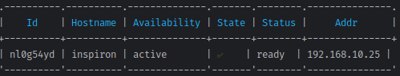
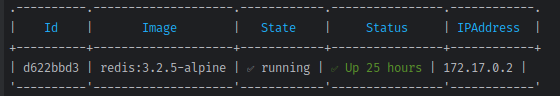
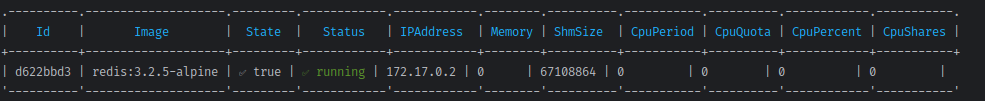

# snake-docker-cli
This is a personal project made in Golang, using cobra-cli, to visualize containers, services and nodes in a docker swarm. Coming soon management of services and containers.
### IMPORTANT:
Do not use port 2375 in production [reference](https://www.speedguide.net/port.php?port=2375)


### Step #1
Create a .env file inside cmd -> config, this file should have the following content:
`DOCKER_HOST=http://localhost:2375/v1.43`

### Step #2 [docker docs](https://docs.docker.com/engine/daemon/remote-access/#configuring-remote-access-with-systemd-unit-file)
1. Execute this command to open an override file for docker.service in a text editor.
```
sudo systemctl edit docker.service
```
2. Add or modify the following lines, substituting your own values.
```
[Service]
ExecStart=
ExecStart=/usr/bin/dockerd -H fd:// -H tcp://127.0.0.1:2375
```
3. Save the file
4. Reload the systemctl configuration.
```
sudo systemctl daemon-reload
```
5. Restart Docker.
```
sudo systemctl restart docker.service
```
6. Run the command in the project root
```
go build .
```
### Usage
```
 ./snake-docker-cli -h
```
```
 ./snake-docker-cli cluster --list
```

```
 ./snake-docker-cli container --list
```


```
 ./snake-docker-cli container --show d622bbd3
```

